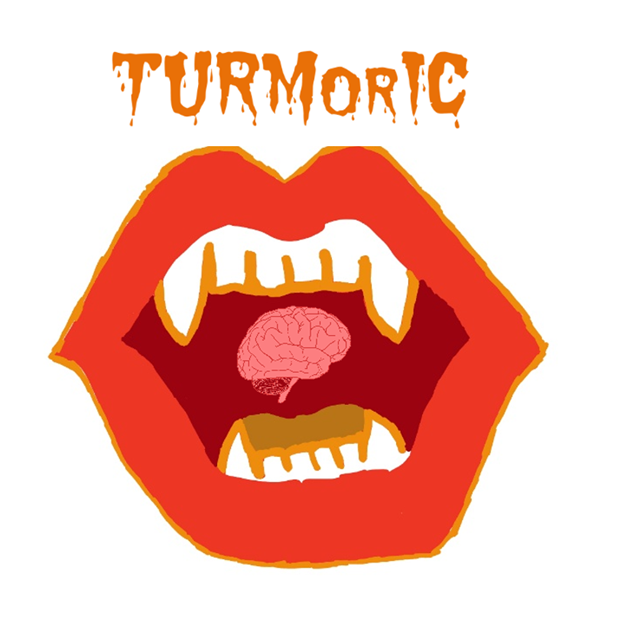

# Planning

Developers: Colin, Krista, Sergi, Muna, Heather

This repository contains the test functions for the updated VAMPIRE (Visually Aided Morpho-Phenotyping Image Recognition) program. The updated program humorously titled "TURMERIC" serves to extract the functions of VAMPIRE and create callable function packages and a user interface. These will allow any user interested in performing brain slice image analysis to do so more readily.

# Inside this repository you will find:
- the MIT license
- the .yml and .toml for the software configuration
- the docs, example_dataset, notebooks, src, and test directories (detailed below)

# docs Directory 
This directory contains documents related to the initial design process for the software package including use cases, user stories, and identified components as well as the team logo and details on the GUI. Finally, there is a slide deck with a presentation given to the CHEM E 546: Software Engineering for Molecular Science and Engineering showcasing the design process of the TURMorIC project.

# example_dataset Directory
This directory includes example .tiff images and expected outputs, like shape mode distribution, for the preprocessing as well as some examples of the segmentation process as well. These serve as potential practice images for understanding the existing code pipeline.

# notebooks Directory 
This directory contains Jupyter notebooks that hold the previous code from VAMPIRE in the subdirectory "notebooks_from_existing_codebase" as the developers work on creating the TURMorIC functions. The subdirectory "temporary_notebooks_for_concept_testing" are Jupyter notebooks that the team can use to work on code before pushing to the main branch.

# src/Nosferatu Directory 
This directory contains all of the source code for the functions of the TURMorIC package. This will be where functions will be committed to the main branch. The directory also holds the GUI components directory and the __init__.py file.

# test Directory 
This directory holds all of the test functions for each of the components. This includes functions to test if the image directory exists, cleaning the file and folder paths, adjusting contrast among other preprocessing steps.
